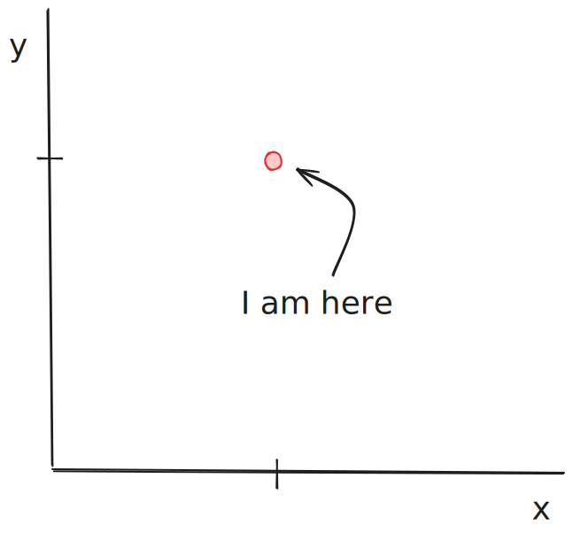
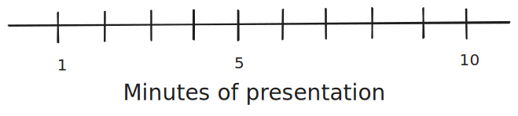

# Coordinate systems and axes

## Coordinates in real life {-}

System for placing **things** in space.

- Chess board ♟️
- [Battleship](https://en.wikipedia.org/wiki/Battleship_(game)) 🚢
- GPS 📍

## Coordinates in data viz {-}

System for placing **data** in space

## Cartesian coordinates {-}

## Coordinates for curved axes {-}

## Polar coordinates {-}

## Geospatial {-}

## Axes {-}

For purposes of this chapter, axes:

- Communicate data units (scale)
- Provide axis ticks that
  - Place data in visual space
  - Translate numbers into visual distance

More practical information on axes later ([here](https://clauswilke.com/dataviz/figure-titles-captions.html#axis-and-legend-titles))

## Scale {-}

Does this belong here?

