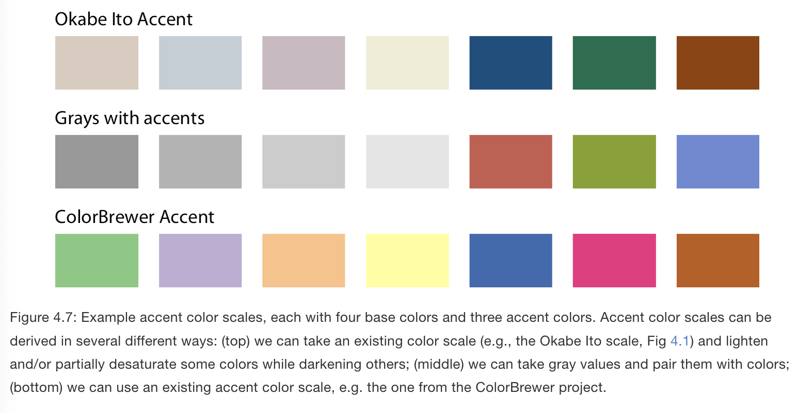

# Color scales

**Learning objectives:**

- Use color to distinguish groups of data from each other  
- Use color to represent data values  
- Use color to highlight 

## Color as a tool to distinguish {-}

- Qualitative color scale: Color distinguish items or groups that are not ordered  
  - finite set of distinct but equivalent colors
  - no color stands out relative to others
  - colors should not create the impression of order
  

**Example:** percent population growth from 2000 to 2010 in U.S. states.
  - Coloring highlights: states in the same regions have experienced similar population growth.

## Color to represent data values {-}

- Colors can be used to represent data values: incomes, temperature, speed. 
- Sequential color scale  
- This sequence will indicate 
  - which values are larger or smaller 
  - color scale needs to be perceived to vary uniformly across range 
  - how distant two specific values are from each other  
  - may be based on a single hue (light blue to dark blue) or multiple hues (light yellow to dark red)
  - multi-hue scales follow a color gradient that is considered "natural"
  

**Example:** choropleths. Map of annual median income within each county in Texas. 

## Diverging Color Scales: midpoints {-}

- two sequential scales stitched together at a common midpoint (light color)
- visualize deviation of data values in one of two directions relative to a neutral midpoint. Eg. positive and negative values. 
- balanced to indicate progression of colors in either direction is the same. Magnitude on either direction is the same. 

**Example:** Percentage of people identifying as white in Texas counties. 
  - 50% is a meaningful midpoint value  
  
  

## Color as a tool to highlight {-}

- highlight specific categories or values in data with color  
- by emphasizing relevant figure elements we can strngthen the story 
- color set that has certain colors that vividly stand out against the rest
- accent color scales
- baseline colors must not compete for attention and instead support the accent color  
- When in doubt, make baseline colors gray 

**Example:** Variant of figure 2 to highlight two specific states: Texas and Louisiana. 

