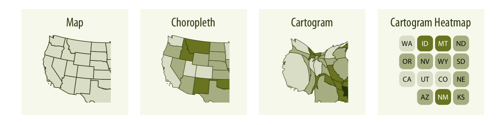

# Directory of visualizations

**Learning objectives:**

- Quick visual overview of various plots and charts commonly used.

## Amounts {-}

## Distributions {-}

## Proportions {-}

## x-y relationships {-}

## Geospatial data {-}

## Uncertainty {-}

