# Visualizing amounts

## 6.1 Bar plots {-}

- Plot a quantitative variable (e.g. an amount) versus a categorical variable 

- Axes showing amounts (e.g. bar charts) start at 0 

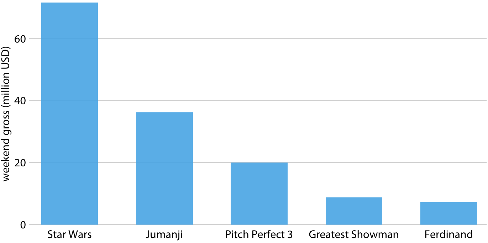

- Axes labels for the categorical variable are a common frustration. Solutions include:

    - Rotating labels up to 90 degrees
    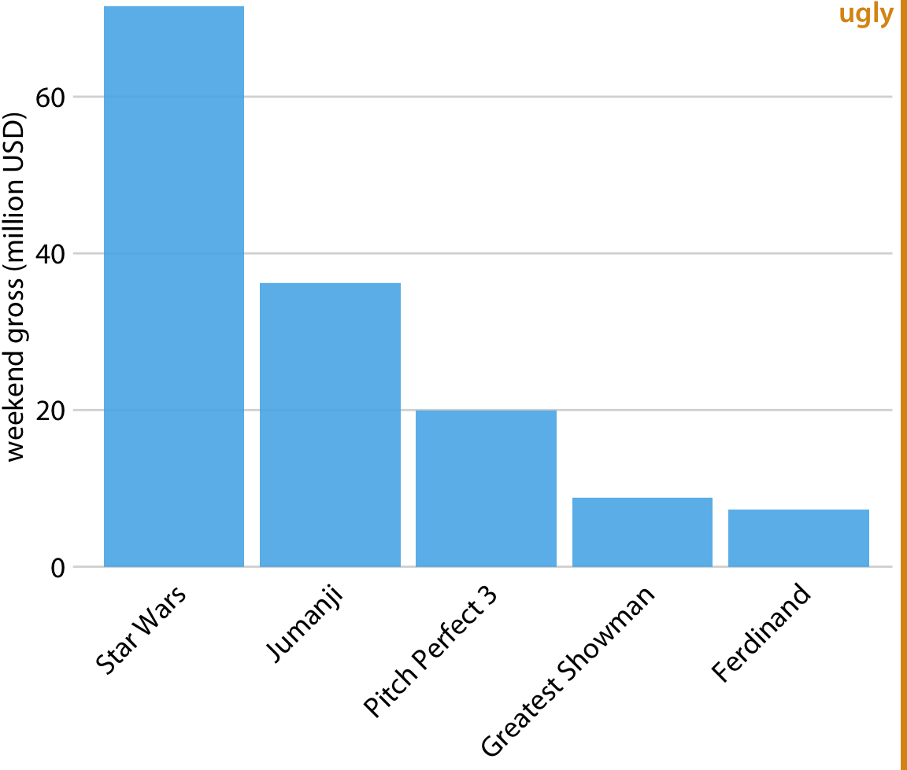

    - Flipping the x and y coordinates 
    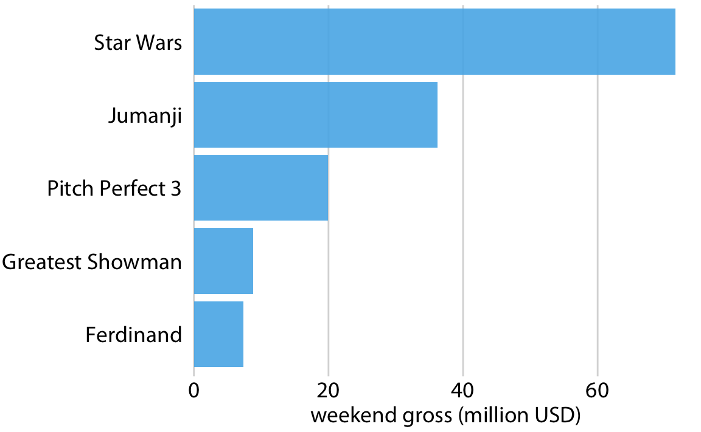

    - Wrapping long labels
```{r}
#| echo: false
#| warning: false
#| message: false

library(forcats)
library(ggplot2)
library(stringr)

dviz_font_family <- "Myriad Pro"

theme_dviz_hgrid <- function(
  font_size = 14,
  font_family = dviz_font_family,
  line_size = .5,
  rel_small = 12 / 14,
  rel_tiny = 11 / 14,
  rel_large = 16 / 14,
  colour = "grey90"
) {
  half_line <- font_size / 2

  cowplot::theme_minimal_hgrid(
    font_size = font_size,
    font_family = font_family,
    line_size = line_size,
    rel_small = rel_small,
    rel_tiny = rel_tiny,
    rel_large = rel_large,
    colour = colour
  ) %+replace%
    theme(
      plot.margin = margin(half_line / 2, 1.5, half_line / 2, 1.5),
      complete = TRUE
    )
}

boxoffice <- data.frame(
  rank = 1:5,
  title = c(
    "Star Wars: The Last Jedi",
    "Jumanji: Welcome to the Jungle",
    "Pitch Perfect 3",
    "The Greatest Showman",
    "Ferdinand"
  ),
  title_short = c(
    "Star Wars",
    "Jumanji",
    "Pitch Perfect 3",
    "Greatest Showman",
    "Ferdinand"
  ),
  amount = c(71565498, 36169328, 19928525, 8805843, 7316746),
  amount_text = c(
    "$71,565,498",
    "$36,169,328",
    "$19,928,525",
    "$8,805,843",
    "$7,316,746"
  )
)

boxoffice |>
  ggplot(aes(x = fct_reorder(title_short, rank), y = amount)) +
  geom_col(fill = "#56B4E9", alpha = 0.9) +
  scale_y_continuous(
    expand = c(0, 0),
    breaks = c(0, 2e7, 4e7, 6e7),
    labels = c("0", "20", "40", "60"),
    name = "weekend gross (million USD)"
  ) +
  scale_x_discrete(name = NULL, labels = \(x) {
    stringr::str_wrap(x, width = 10)
  }) +
  coord_cartesian(clip = "off") +
  theme_dviz_hgrid(rel_small = 1) +
  theme(
    axis.line.x = element_blank(),
    axis.ticks.x = element_blank(),
    plot.margin = margin(3, 7, 3, 1.5)
  )
```

- Ordering bars by ascending or descending data values, or by a natural order, aids in perceptability

::: {layout-ncol=2}

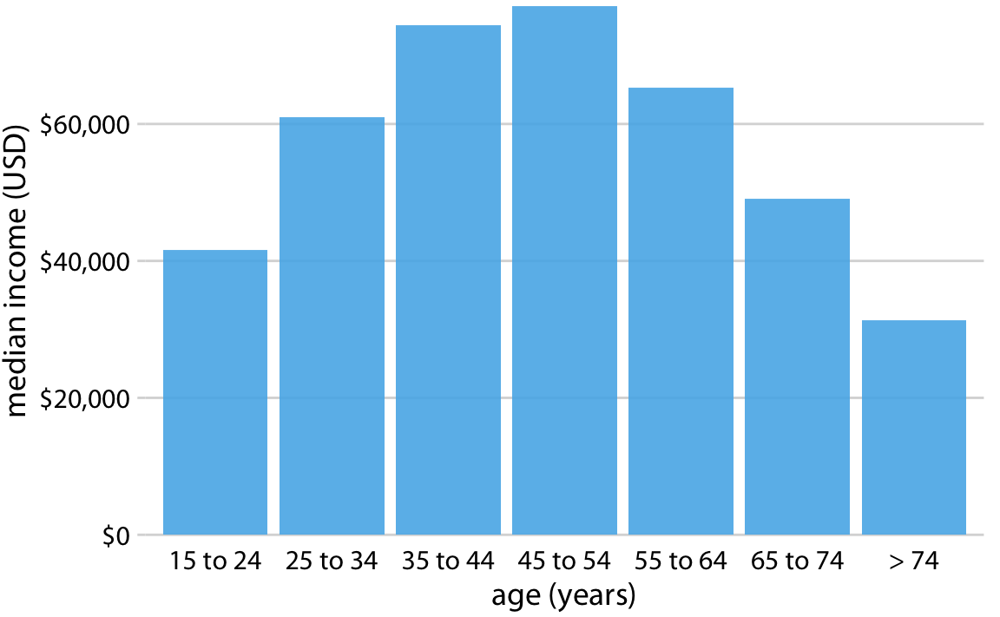

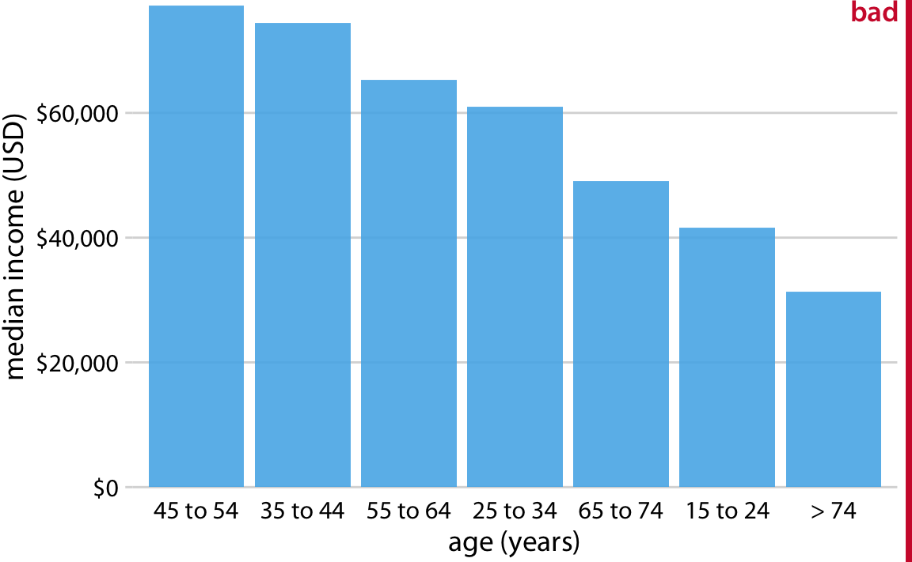

:::

::: {.callout-note}
Since the quantitative variable axis must start at zero, are bar charts suitable for logarithmic scales, ratios, or products (all of which don't necessarily include zero)?
:::


## 6.2 Grouped and stacked bars

- Plot a quantitative variable versus a categorical variable split by another categorical variable via an aesthetic (e.g. colour) 

- Which categorical variable is assigned to the axis vs. the aesthetic affects messaging

::: {layout-ncol=2}

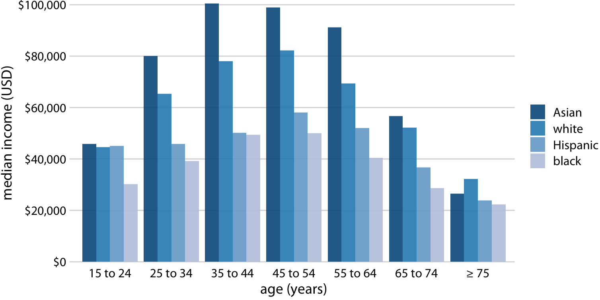

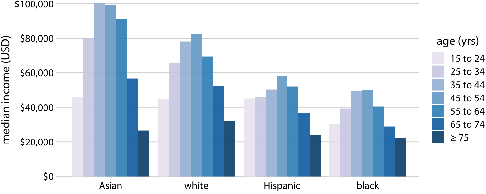

:::

- Grouped bars are plotted side by side and stacked bars are plotted one on top of the other

- Facetting is another approach that avoids scaling a categorical variable via an aesthetic 

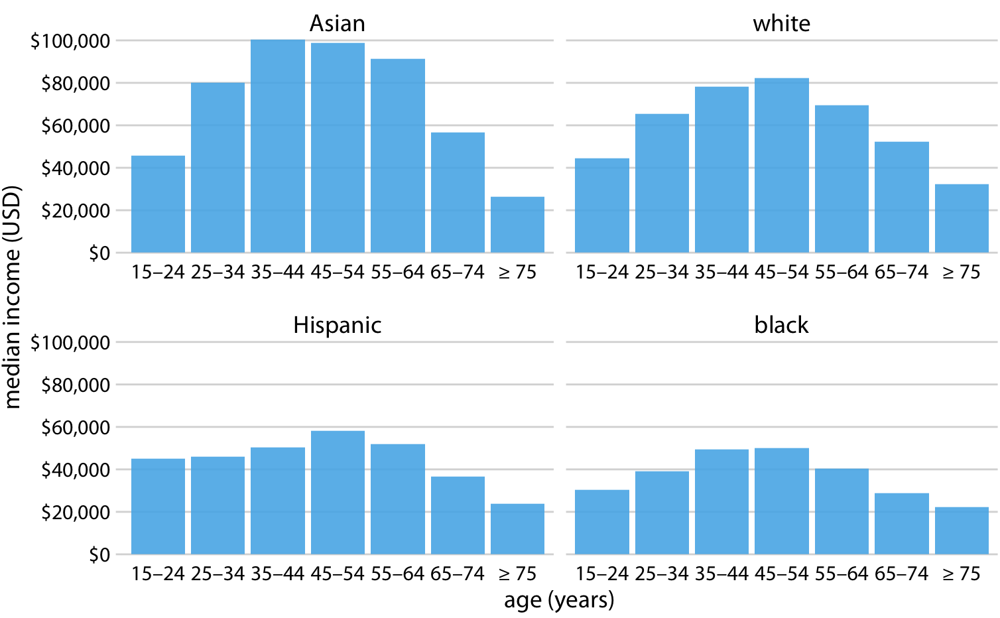

- Simple bar charts can convey a message without axes labels for the quantitative variable 


## 6.3 Dot plots and heatmaps

- Axes don't need to start at zero, therefore useful for visualizing differences among similar amounts

::: {layout-ncol=2}

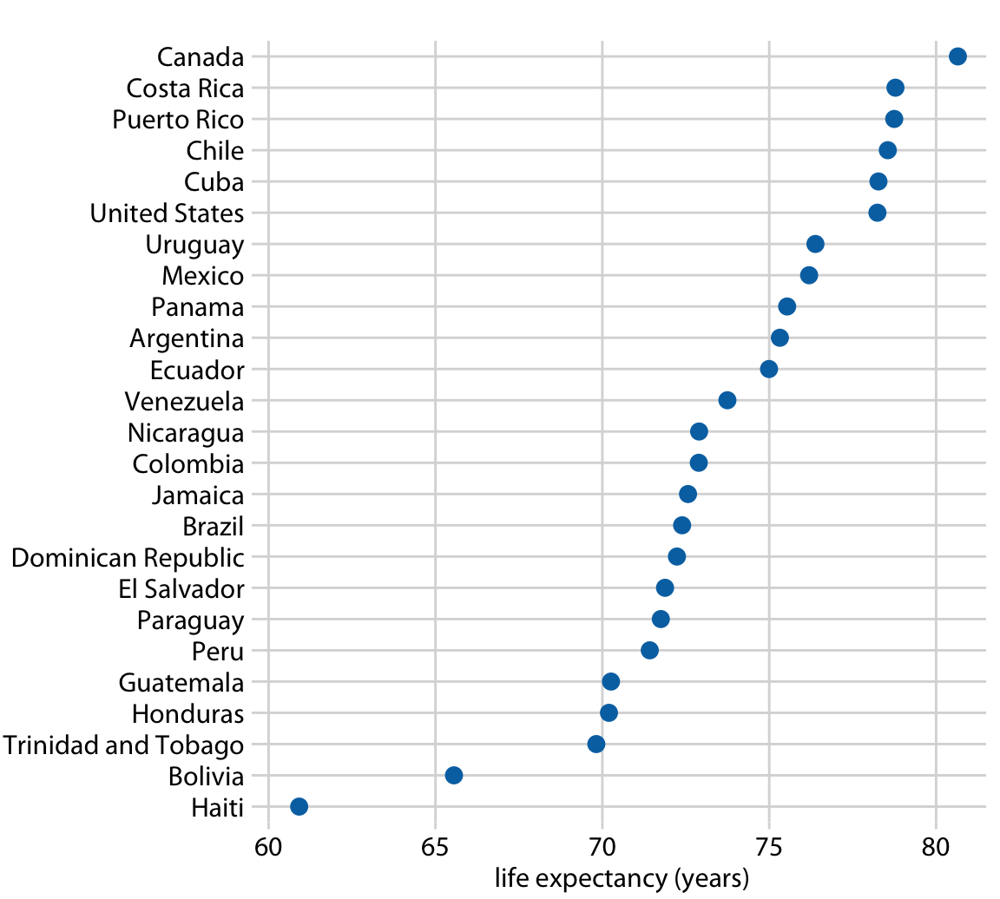

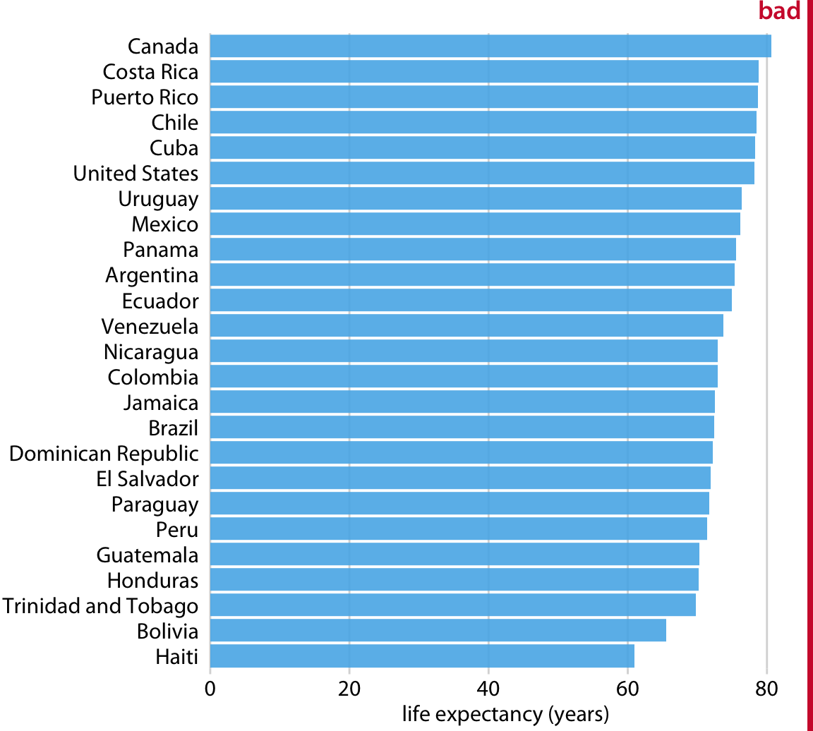

:::

- Heatmaps encode the amount as a colour aesthetic and are useful for visualizing two categorical variables with many values  

- As in bar charts, ordering matters in dot plots and heatmaps to the message

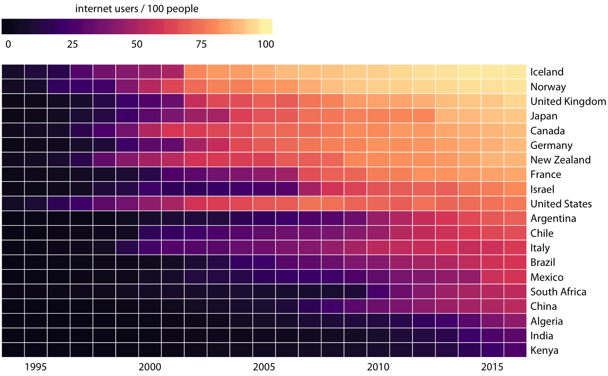
