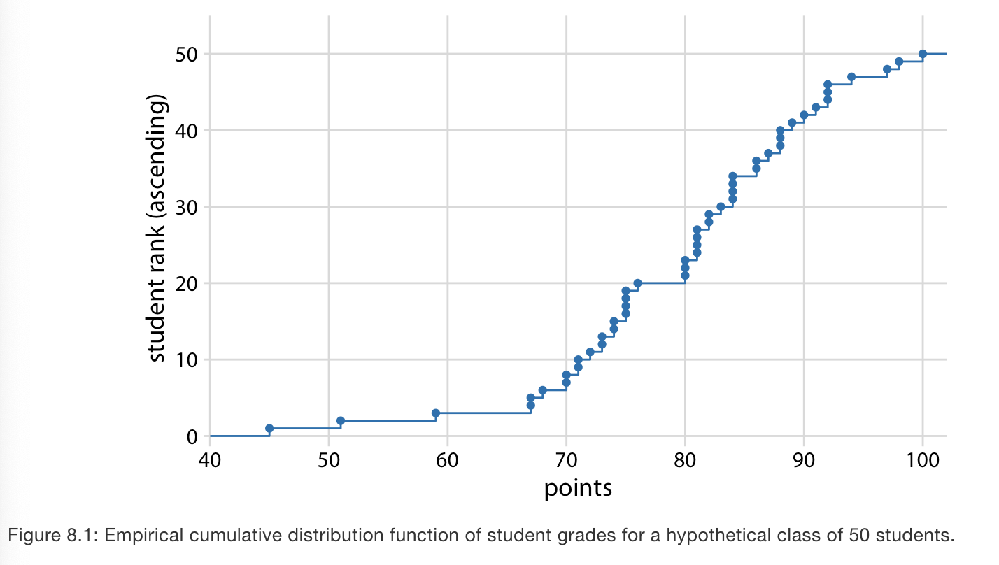
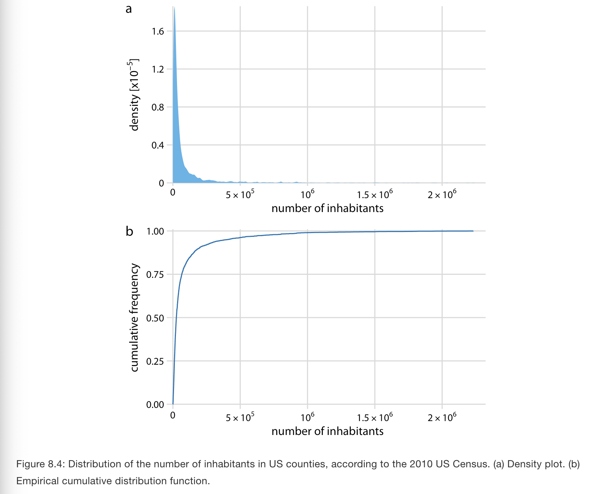
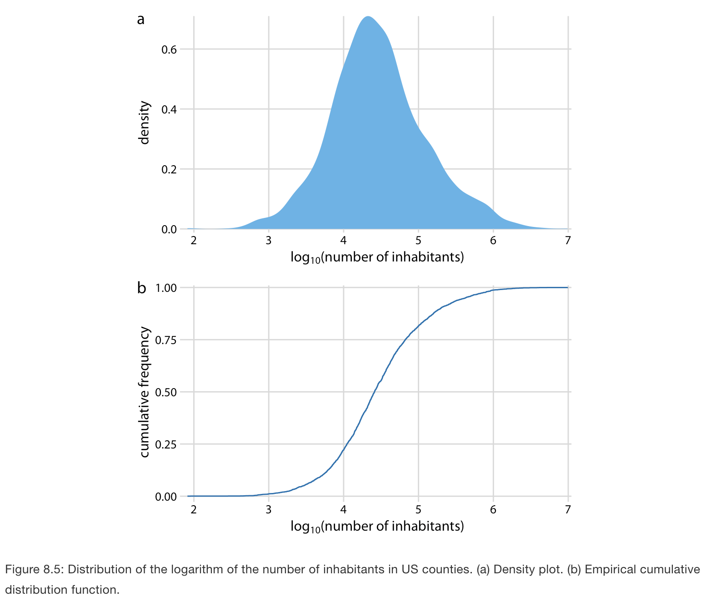
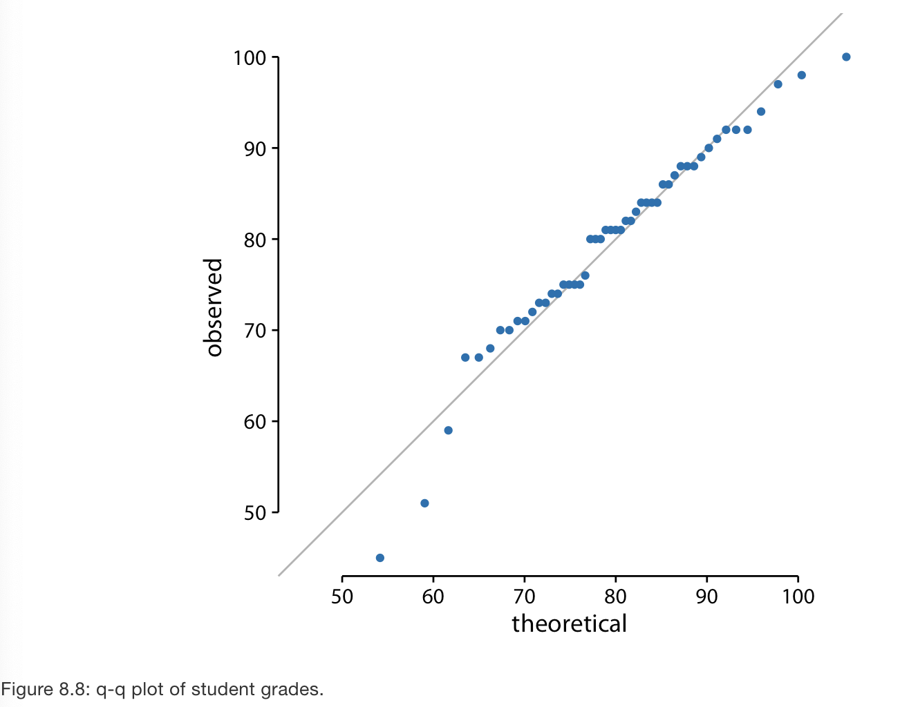

# Visualizing distributions: Empirical cumulative distribution functions and q-q plots

**Learning objectives:**

- Learn about alternative plots to histograms and density plots to visualize distributions.

## Empirical cumulative distribution functions {-}

- Example: student grades. A hypothetical class with 50 students that just completed an exam on which they could score between 0 and 100 points.   
  - How can we best visualize the class performance, for example to determine appropriate grade boundaries?  
  - **Answer:** with a cumulative distribution. The y-axis shows the students ordered by rank and the x-axis shows the student's grades. 

  
- **Key points from the plot:** Aprox 25% of students received less than 75 points. The median (50%) is 81. And 20% of students got 90 or more.

## Highly skewed distributions {-}

- Heavy tails to either side. 
- If we try to visualize these distributions then we end up with graphs that are useless:

- **Solution:** let's log-transform the data and visualize the distribution of log-transformed values. This works because the population numbers in counties follows a log-normal distribution. 

## Quantile-Quantile plots {-}

- Used to determine if data follows a given distribution.  
- Most commonly, q-q plots are constructed using a normal distribution as the reference.
- Normal distributions fall on the x=y line.  

