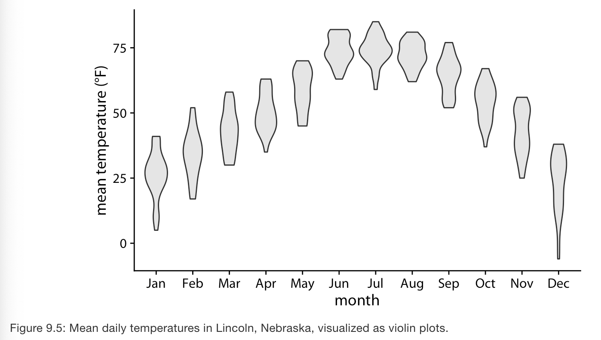
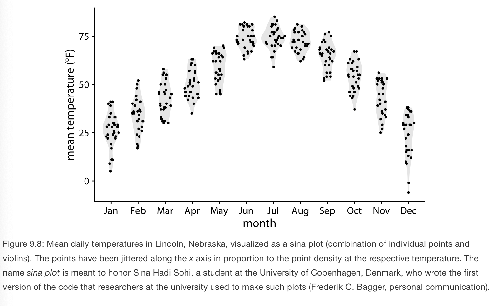
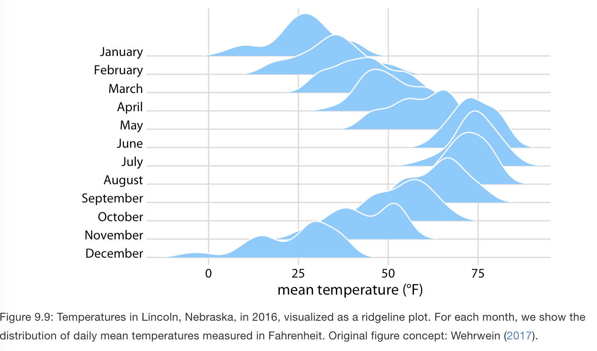
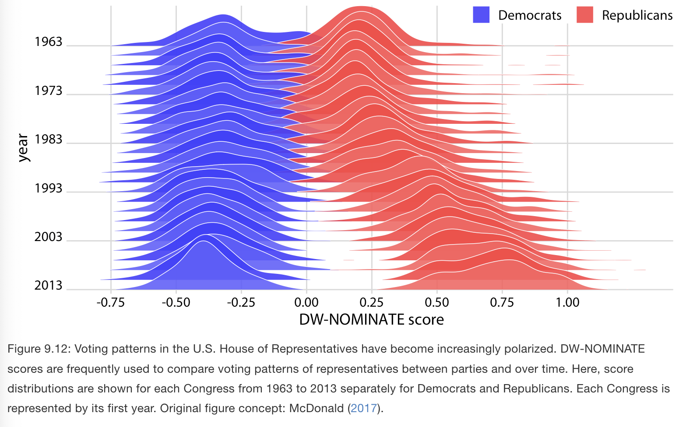

# Visualizing many distributions at once

**Learning objectives:**

- Learn graphs that may show multiple distributions. 
- Compare violin plots with boxplots. 
- Differentiate between distribution plots that are along the vertical or horizontal axis. 

## Introduction 1 {-}

- Consider weather data. Visualize how temperature varies across different months while also showing the distribution of observed temperatures within each month.  
- Response variable and one or more grouping variables. 
  - Response variable: the variable whose distribution we want to visualize. 
  - Grouping variables: subsets of data with distinct distributions of the response variable. E.g., Temperature distribution across months. Months is the grouping variable. 
  

## Visualizing distributions along the vertical axis {-}

- Example: Monthly temperatures in Lincoln, NE. 

- Violin plots are very useful to show multiple distributions but have some shortcomings: 
  - they can generate the appearance that there is data where none exists, or that the data set is very dense when actually it is quite sparse. 

- Sina plots combine jittered points with violin plots which shows each individual point while also visualizing distributions. 

## Visualizing distributions along the horizontal axis {-}

- By staggering the distribution plots in the vertical direction we get the **ridgeline plot**. 

- Work really well to compre two trends over time. 
- You can use color to separate categories. 

