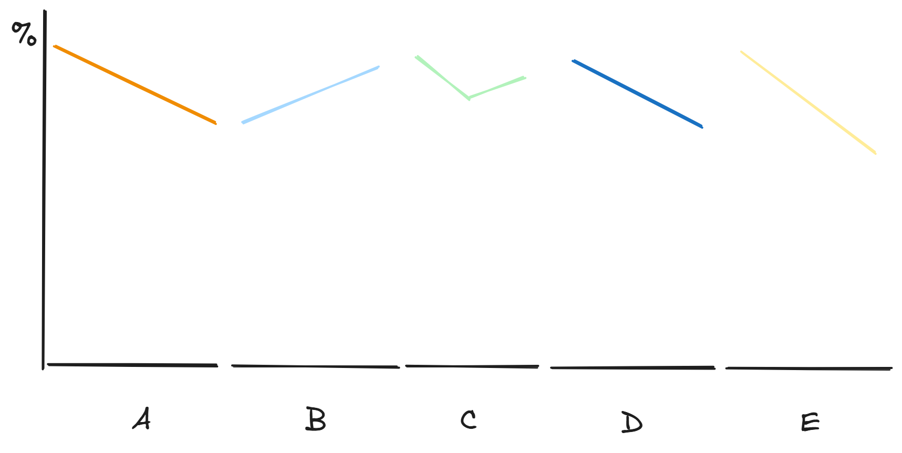

# Visualizing proportions

## How to plot percentages: it depends {-}

> Many authors categorically reject pie charts and argue in favor of side-by-side or stacked bars. Others defend the use of pie charts in some applications. My own opinion is that none of these visualizations is consistently superior over any other. **Depending on the features of the dataset and the specific story you want to tell, you may want to favor one or the other approach.**

## Pie {-}

### Where it works {-}

- Few groups
- Simple fractions
- Perceptually obvious pattern

## Where it fails {-}

- More groups
- Perceptual problems with radial area
- Ranking groups (due to percetual problems)

## Other viz strategies {-}

#### Stacked bar {-}

#### Side-by-side bar {-}

**Good:**

Relative comparisons:

- Magnitude
- Ranking

**Bad:**

Comparison of part to the whole

##  Waffle {-}

Source: https://www.gov.uk/government/publications/a-bite-sized-guide-to-visualising-data-a-dstl-biscuit-book/a-bite-sized-guide-to-visualising-data

- Equally sweet when pie charts are
- But overcomes the radial area problem

## Side-by-side bars {-}

#### Less bad than the alternatives {-}

Cannot measure pie slices--neither at one time nor over time

Cannot easily measure relative sizes of bars (although trend over time is clearer)

## Where it works {-}

- Many groups
- Comparisons both witin a time period and across time periods

## But could it be made better? {-}

Group by company rather than time

Use a line rather than bars

## Stacked bars {-}

When:

- few--ideally two--groups
- (line showing majority)

## Stacked densities {-}

When

- x axis represents a continuous variable
- few groups

Since "[s]tacked densities can be thought of as the limiting case of infinitely many infinitely small stacked bars arranged side-by-side", they have suffer from a similar problem:

- Judging relative proportion of groups over time (where magnitude changes are not obvious)

When not:

- Focus on absolute numbers

## Percentages separately as parts of a whole {-}

### Group count compared to total count {-}

Works well:

- Part of whole (via "perceptual percentage")
- Trend over time

Some shortfalls:

- Measuring relative size of proportion is imprecise and impressionistic
- Comparing across groups for time T involves lots of looking back and forth (better if facets in single column?)
- Doesn't actually display a proper %

### Relative percentages {-}

