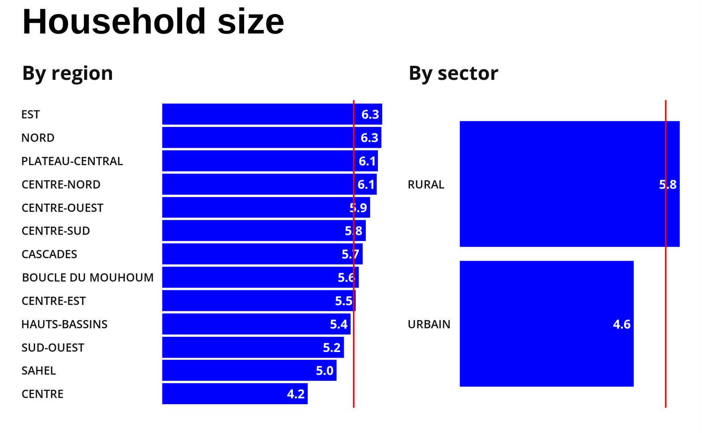

# Visualizing nested proportions

## Nested proportions {-}

By <a href="//commons.wikimedia.org/wiki/User:BrokenSphere" title="User:BrokenSphere">BrokenSphere</a> - Own work, <a href="https://creativecommons.org/licenses/by-sa/3.0" title="Creative Commons Attribution-Share Alike 3.0">CC BY-SA 3.0</a>, <a href="https://commons.wikimedia.org/w/index.php?curid=3773186">Link</a>

Part of a whole, broken down into parts of that part, etc.

For example: percent of households in the country with access to electricity, by region and by urban/rural

## _Caveat visualizator_ {-}

A naïve attempt to use the strategies from the previous chapter won't work:

- If one sums the % of each group, it sums to more than 100%.
- Because each visualized category to multiple groups (e.g., bridge era and bridge material)

## What may work {-}

- Mosaic plots / treemaps
- Nested pies
- Parallel sets

## Mosiac plots {-}

Each area belongs to two or more groups.

In the example below, each bridge is both part of a era group (crafts, emerging, mature, modern) and a material group (wood, iron, steel)

## Treemaps {-}

Each child group belongs to one parent group.

For the example below, each state belongs to one and only one region.

## Problems of mosaic / treemaps {-}

Gets visually busy very fast

Hard to judge size, among other reasons, because of the different shapes of groups

## Nested pie {-}

How:

- Make combination of groups is a slice of the pie.
- Use colors and color scales to telegraph which slice belongs to which bigger group

Problems:

- Radial area problem
- Readability declines with the number of slices

## Parallel sets {-}

## Other strategies {-}

- Sunburst
- Coxcomb / Nightingale
- Multiple charts: overview; selective drill-down
- Interactive drill-down

## Sunburst {-}

### Fixed length {-}

Aka radial treemap (?)

- Inner ring: % of group level 1
- Outer ring: % of group level 2 within level 1

### Varying length {-}

Length of bars: another attribute within the second level--in the case below, median salary.

### Nice resources {-}

- [Overview](https://www.data-to-viz.com/graph/sunburst.html)
- [Extended worked example](https://www.pipinghotdata.com/posts/2021-06-01-custom-interactive-sunbursts-with-ggplot-in-r/)
- [R package](https://sachijay.github.io/ggsunburst/index.html)

## Coxcomb / Nightingale {-}

Cause of death

- Blue: preventable disease
- Red: wounds
- Black: all other causes

## Multiple charts: overview; selective drill-down {-}

Just imagine there was drill-down into one category

## Interactive drill-down {-}

See [here](https://quarto.org/docs/interactive/ojs/index.html#example).
