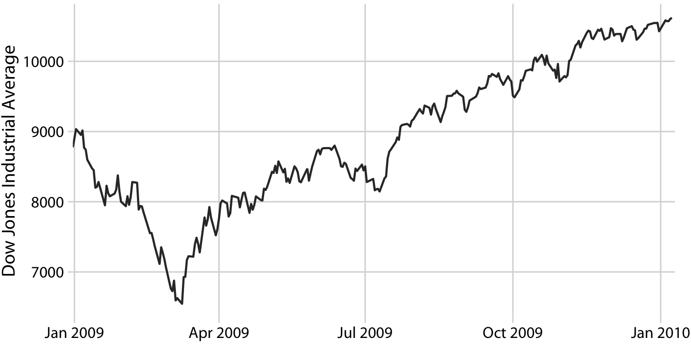
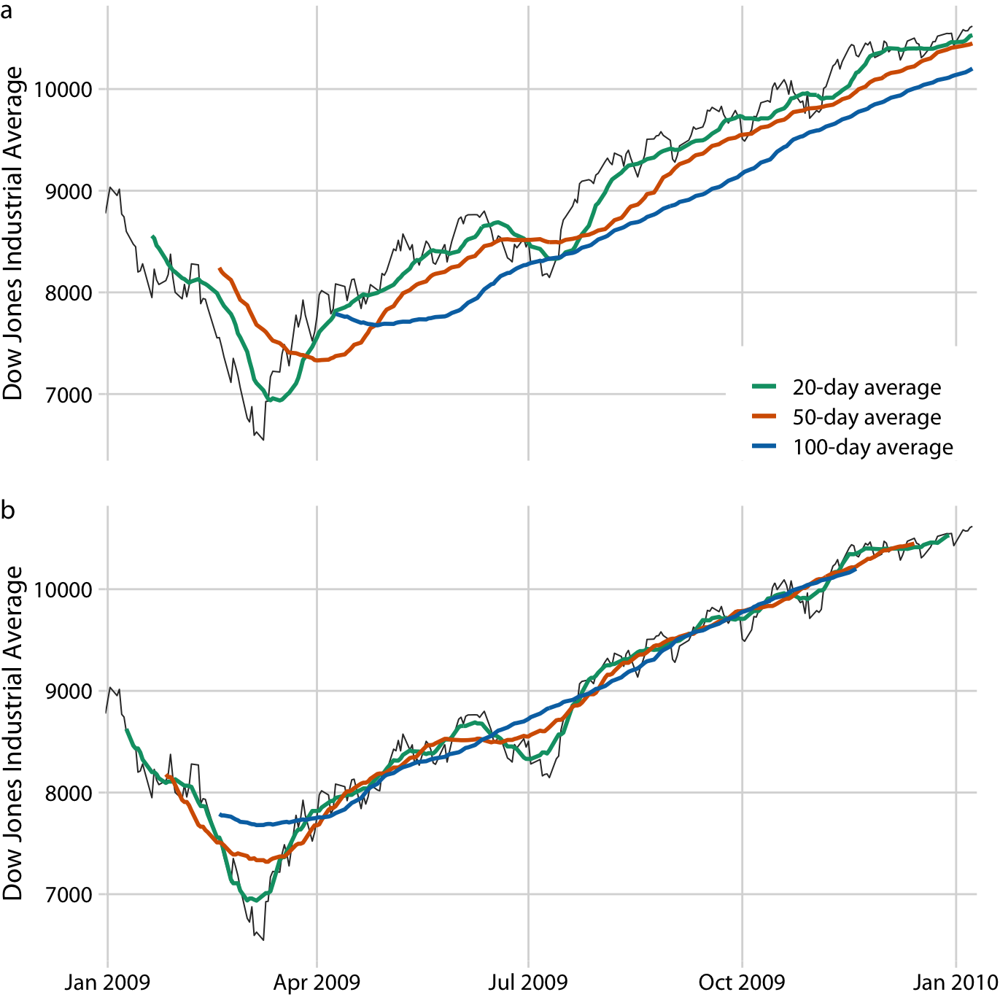
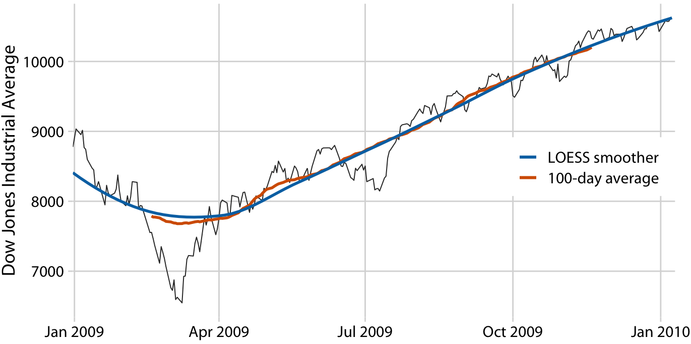
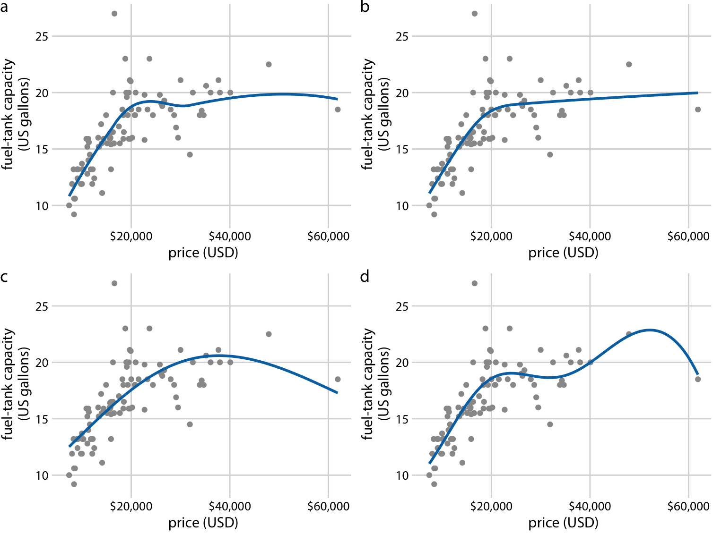
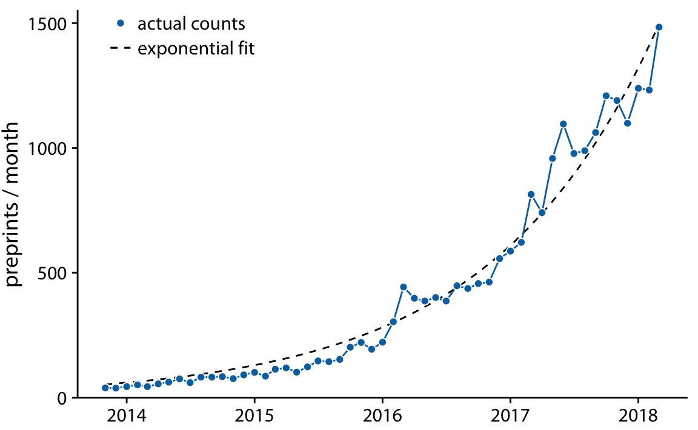
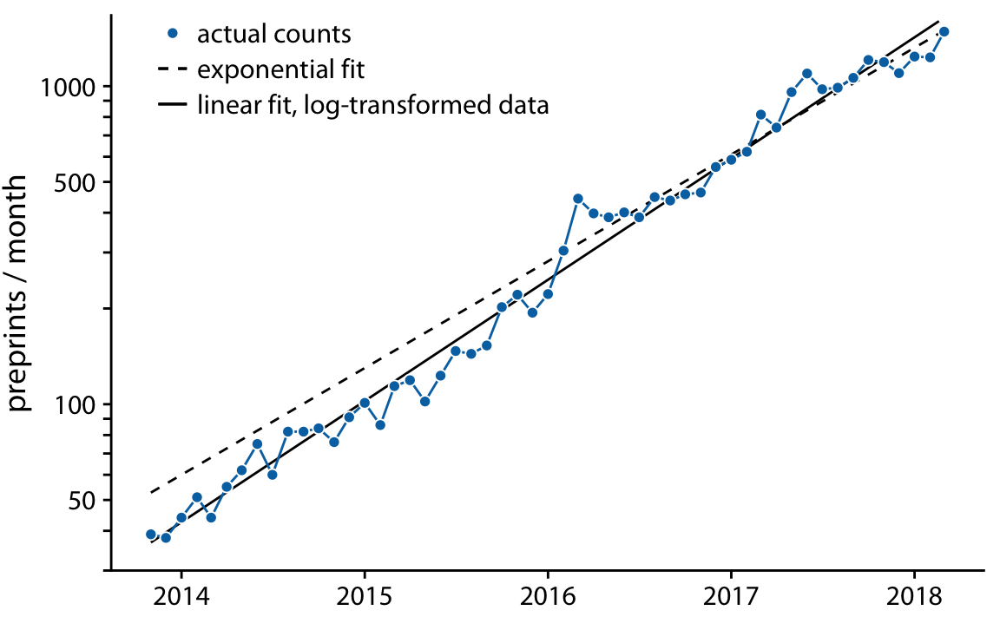
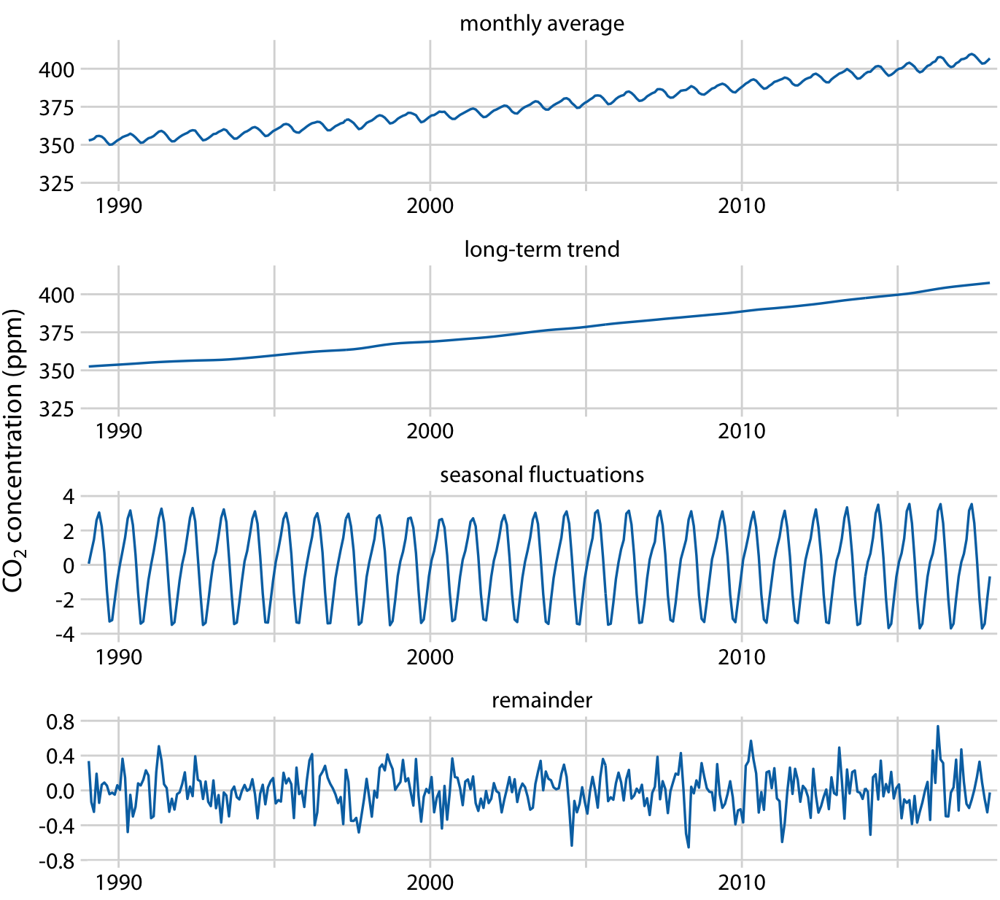

# Visualizing trends

**Learning objectives:**

- Understand how to create smooth trend lines by:
    - transforming data
    - applying smoothing functions
    - applying defined functions
    - transforming axes

- Understand the basics of detrending a time series

## Why smooth? {-}

- Makes key messages clearer by reducing noise

 

## Smoothing by transforming data {-} 

- Moving averages are an _average_ over a moving window, so noise in the data is reduced

- Averages over units of time (e.g. days, weeks, months, years) also have the effect of reducing noise

 

## Smoothing by applying smoothing functions {-}

- The LOESS works 'out of the box' and produces attractively smoothed trend lines

- LOESS smoothers have parameters that affect the amount of local smoothing (i.e. how wiggly the line is)

 

- Splines give you more control over the shape of the smoothed line 

 

- NB: smoothing without including the original data begets misinterpretation

## Smoothing by applying defined functions {-}

- Applying a defined function (e.g. linear, exponential, sigmoidal) is likely more intepretable than a general-purpose smoother

- But how do you know if the function you chose is a good fit? Model statistics (e.g. r-squared)? 

 

## Smoothing by transforming axes {-}

- In many cases, log-transforming data tends to make the data more linear

- Log-transforming data and plotting a linear model often presents a smoothed linear trend line that closely matches the data

- However, log transformations are not always the easiest to interepet

 

## Detrending a time series {-}

- Time series are made up of multiple components including:
    - Long-term trends
    - Seasonal patterns
    - Cyclical (but non-seasonal) patterns
    - Random noise
    - Phenomena of interest

- Detrending a time series means removing as many components as you can, leaving only the phenomena of interest left to visualize/analyze

- I recommend the [`{fable}`](https://fable.tidyverts.org/) package for time-series analysis

 

