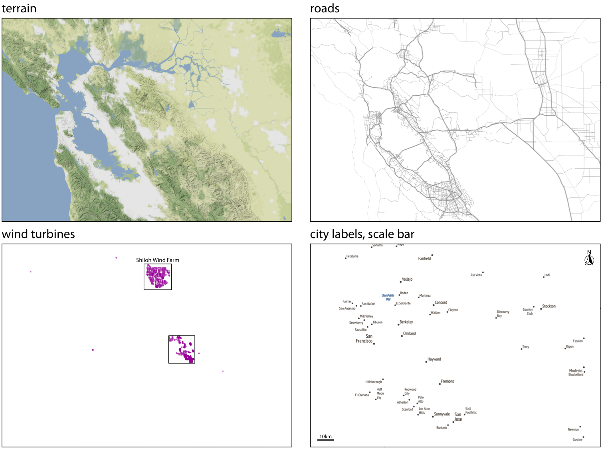
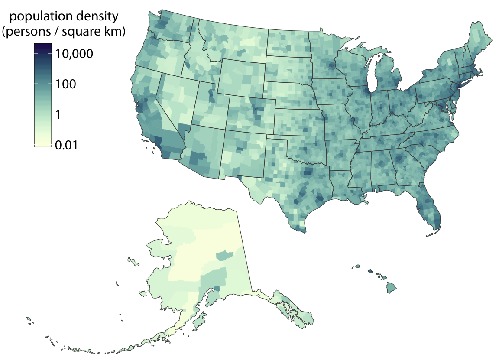
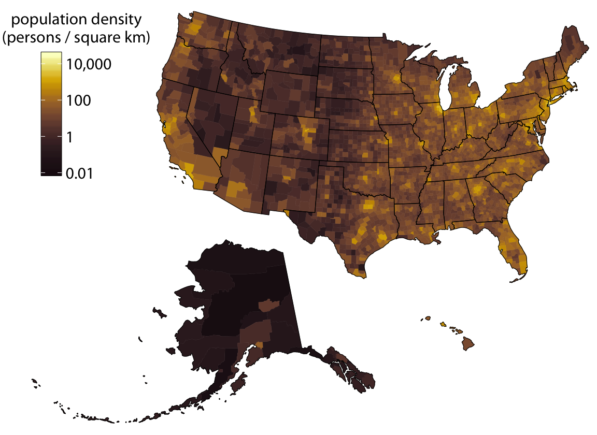
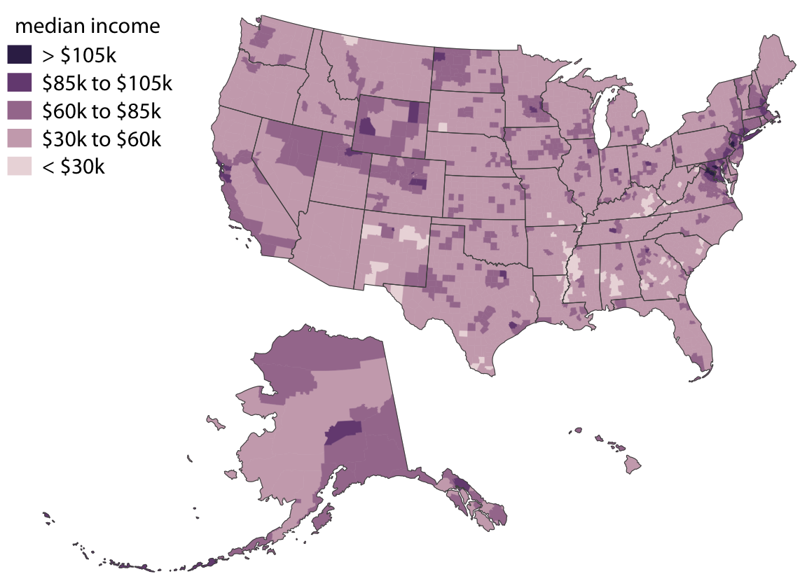
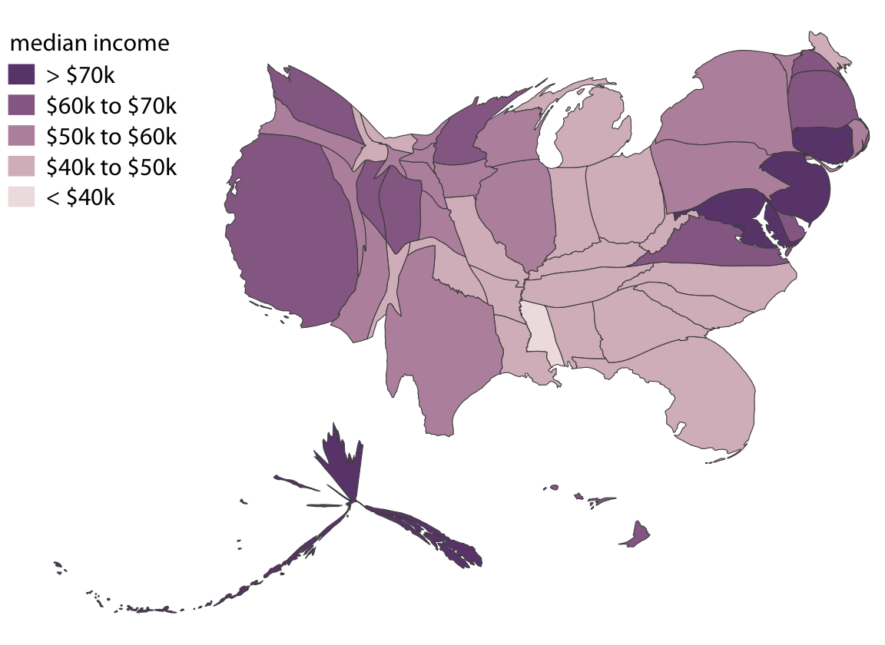
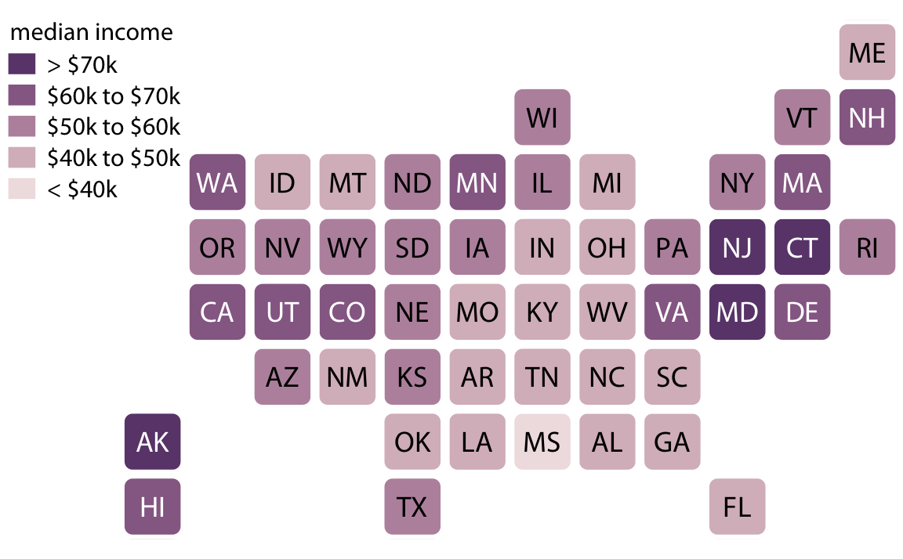
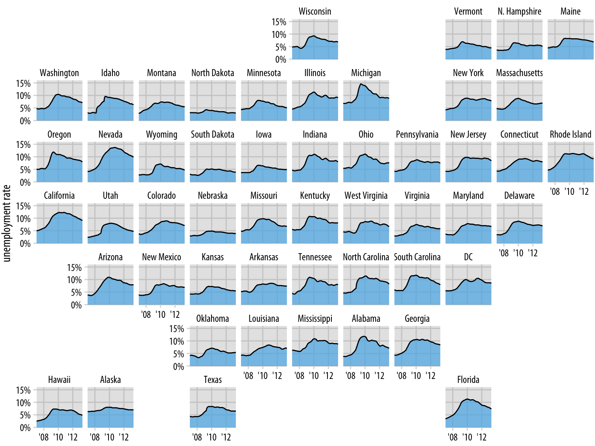

# Visualizing geospatial data

**Learning objectives:**

- Understand key concepts in geospatial data viz, including:
    - Datums
    - Projections / Coordinate reference systems 

- Identify choropleth maps and their variants

## The earth as an oblate elipsoid {-}

- The earth isn't a perfect sphere - it's squished at the poles and bulging at the equator

- The earth's size and shape is modelled by datums like WGS84

- Other datums exist for specific uses (ITRS/ITRF, high-precision), NAD83 for North America, etc.

## Projections {-}

- Projections convert the 3D surface of the earth to a 2D image 

- All projections sacrifice something - size, shape, or both. 

- Projections that preserve size are called equal-area and those that preserve shape are conformal

- Various types of the same basic projection exist (e.g. Albers projection focused on specific countries, states, provinces, etc.)

- Choose a projection that makes sense for your area of interest

## Layers {-}

- Base layers (terrain, elevation, streemap, etc.) (See https://leaflet-extras.github.io/leaflet-providers/preview/)

- Geometry layers (polygons, lines, or points)

- Raster layers

- Text layers 

 

- NB: Scale bars aren't accurate when using conformal projections (i.e. size is sacrified) across large latitudinal spans

## Choropleth mapping {-}

- Use colour to show intensity of a value per geometry polygon 

- Darker colours represent higher intensities of the value 

 

- The inverse applies if the map is viewed on a dark background 

 

- Use discrete colour scales 

 

## Cartograms {-}

 

 

 