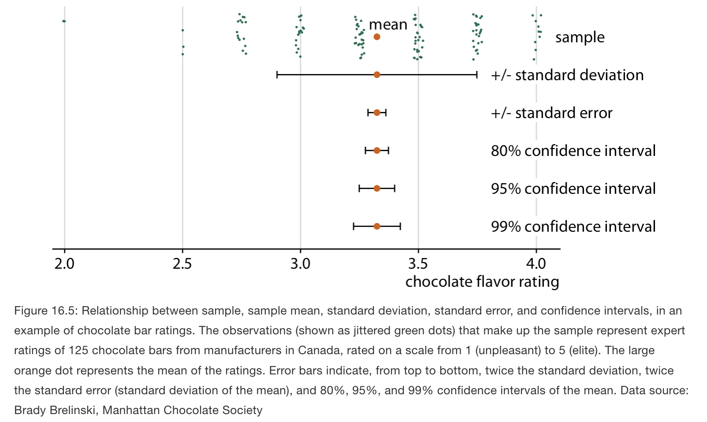
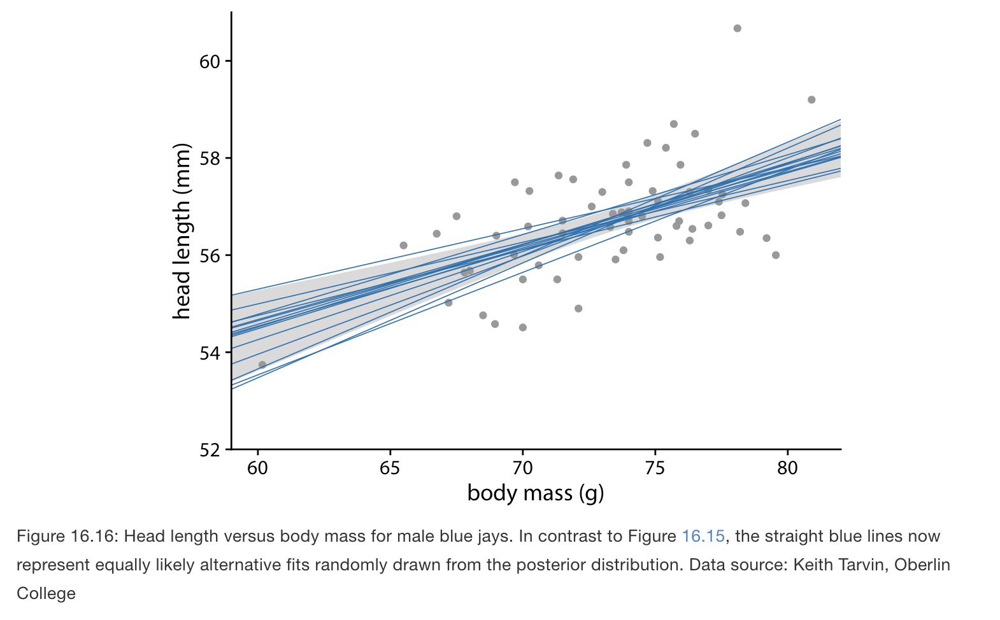

# Visualizing uncertainty

**Learning objectives:**

- Review different ways to measure uncertainty 
- Contrast different ways to visualize uncertainty 

## Visualizing uncertainty {-}

- The most commonly used approaches to visualizing uncertainty are error bars and confidence bands. 

- There are a lot of ways to represent uncertainty, depending on the type and the knowledge of the audience we want to convey a message to

## Probabilities as frequencies {-}

- First, let's clarify the concept of uncertainty. 
- In Math we define uncertainty in terms of probability. 
- For example, if we toss a coin then we can expect a particular outcome, drawing tails, will occur with a probability of 10%. Then we expect that among many repeated trials that outcome will be seen in approximately one out of ten cases.
- Uncertainty must be seen with repeated events, not a single one. 

## Visualizing the uncertainty of point estimates {-}

- Let's review a few key concepts.
- In statistics we work with samples drawn from a population. 

- Let's review the differences between the standard deviation and the standard error. The standard deviation is a property of the population. It tells us how much spread there is among individual observations we could make. By contrast, the standard error tells us how precisely we have determined a parameter estimate.  
- Frequentists most commonly visualize uncertainty with error bars.
- A confidence interval is a range of values, calculated from sample data, that has a certain probability of containing the true value of the population parameter being estimated.  

# Bayesian uncertainty {-}

- Frequentists assess uncertainty with confidence intervals, whereas Bayesians calculate posterior distributions and credible intervals. 

- The Bayesian posterior distribution tells us how likely specific parameter estimates are given the input data. The credible interval indicates a range of values in which the parameter value is expected with a given probability, as calculated from the posterior distribution. For example, a 95% credible interval corresponds to the center 95% of the posterior distribution. The true parameter value has a 95% chance of lying in the 95% credible interval.

- A Bayesian credible interval makes a statement about the true parameter value and a frequentist confidence interval makes a statement about the null hypothesis.

## Visualizing the uncertainty of curve fits {-}

- In a dataset we fit a straight line or curve to the data and show the uncertainty in a trend line with a confidence band 
- The confidence band provides us with a range of different fit lines that would be compatible with the data.  

