# The principle of proportional ink

**Learning objectives:**

- Understand the principle of proportional ink 

## The principle of proportional ink {-}

> The principle of proportional ink, coined by Bergstromm and West in 2016, states that **the sizes of shaded areas in a visualization need to be proportional to the data values they represent.**

- Ink commonly refers to any part of the visualization that deviates from the background color: lines, points, shared areas, text. 

- This principle refers to bar graphs or area graphs where the height and the length of the bar represent the data shown. This does not apply to dots or points on a graph, for example. 

## Visualizations along linear axes {-}

- Consider the following graph that shows the median income in the five counties that make up the state of Hawaii.
  - This graph is misleading because while the endpoint of each bar correctly represents the actual median income in each county, the bar height represents the extent to which median incomes exceed $50,000, an arbitrary number.

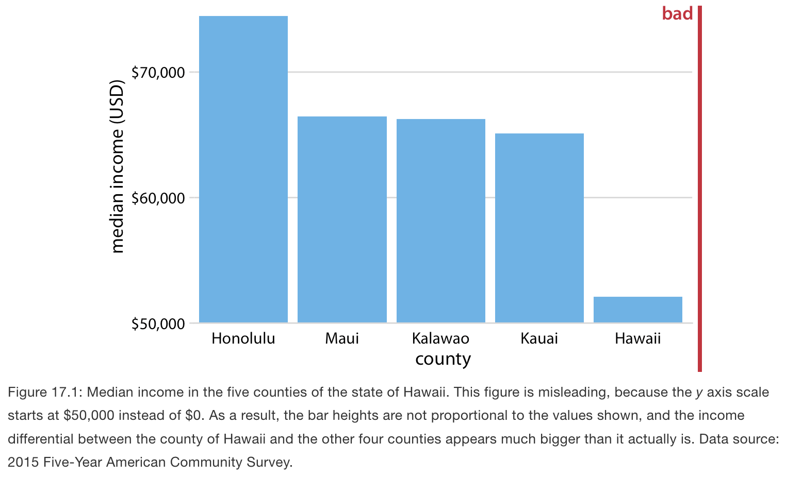

- Similar issues arise with area graphs. 

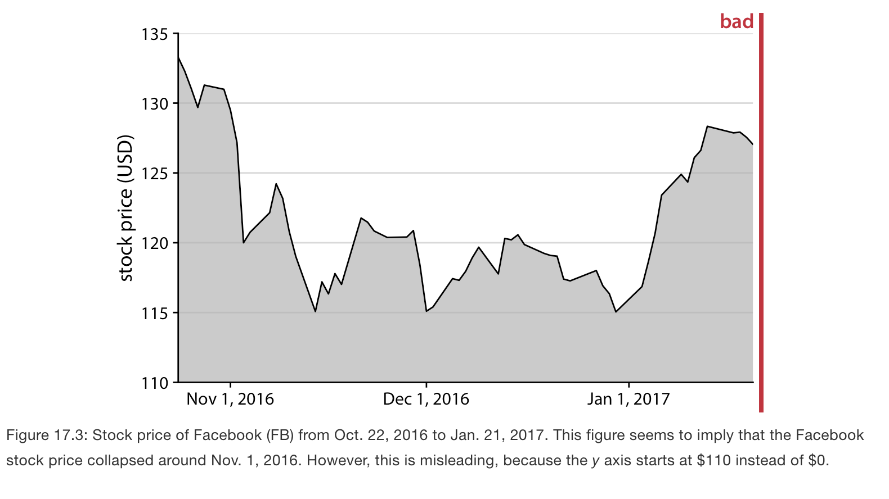

## How to properly represent visualizations along linear axes {-}

- To represent small changes over time or differences between conditions, then consider showing the change in median income in Hawaiian counties from 2010 to 2015. 

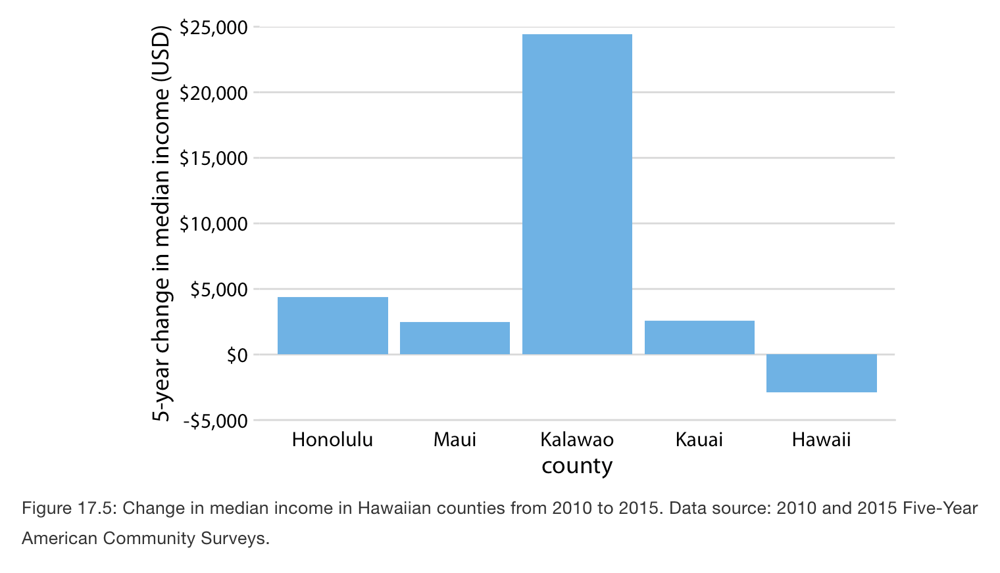

- Similarly, we could shos the change in Facebook stock price over time as the difference from its temporary high point on Oct 22 2016. The shaded area now represents the distance from the high point. 

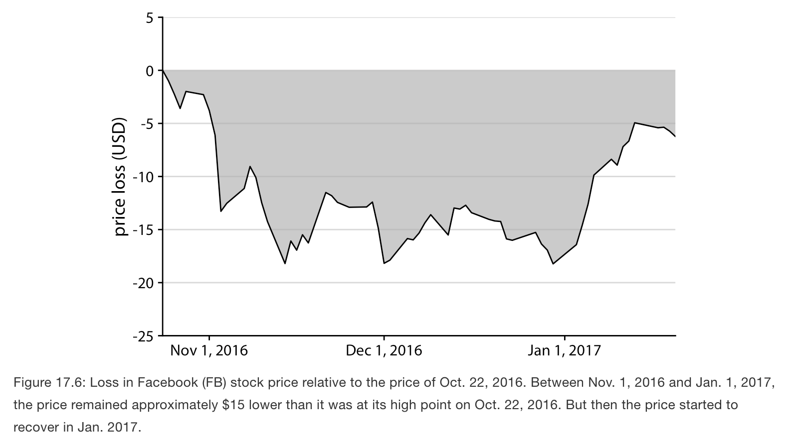 

## Visualization along logarithmic axes {-}

- On a linear scale, bar/rectangle areas are proportional to data values.
- On a logarithmic scale, this proportionality is lost because axis spacing isn’t linear.
- As an example, consider the gross domestic products (GDPs) of countries in Oceania. In 2007, these varied from less than a billion U.S. dollars (USD) to over 300 billion USD. 
  - Visualizing these numbers on a linear scale would not work, because the two countries with the largest GDPs (New Zealand and Australia) would dominate the figure.  

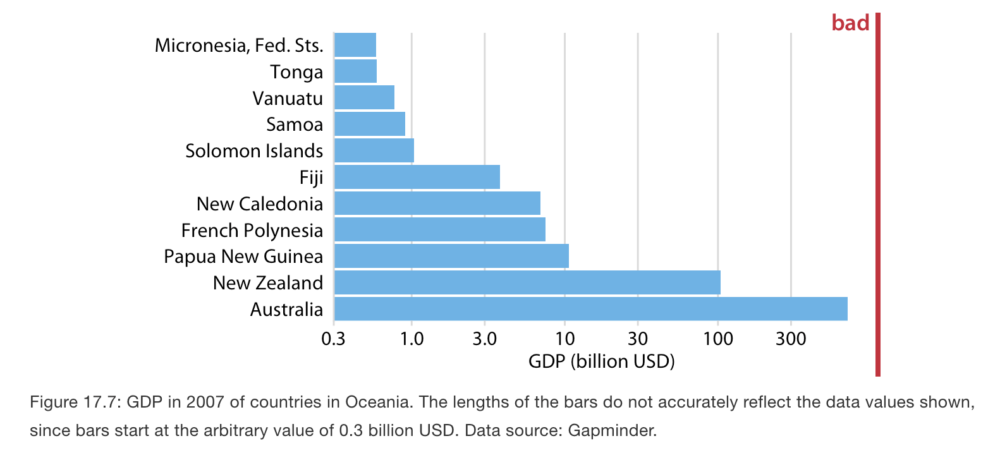

## Working with log scales that do not work {-}

- However, the visualization with bars on a log scale does not work either. The bars start at an arbitrary value of 0.3 billion USD, and at a minimum the figure suffers from the same problem, that the bar lengths are not representative of the data values. 

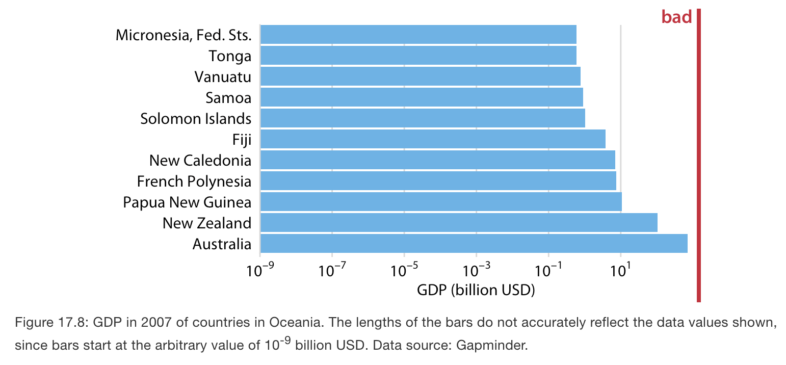

- To fix it, change bars to points. 

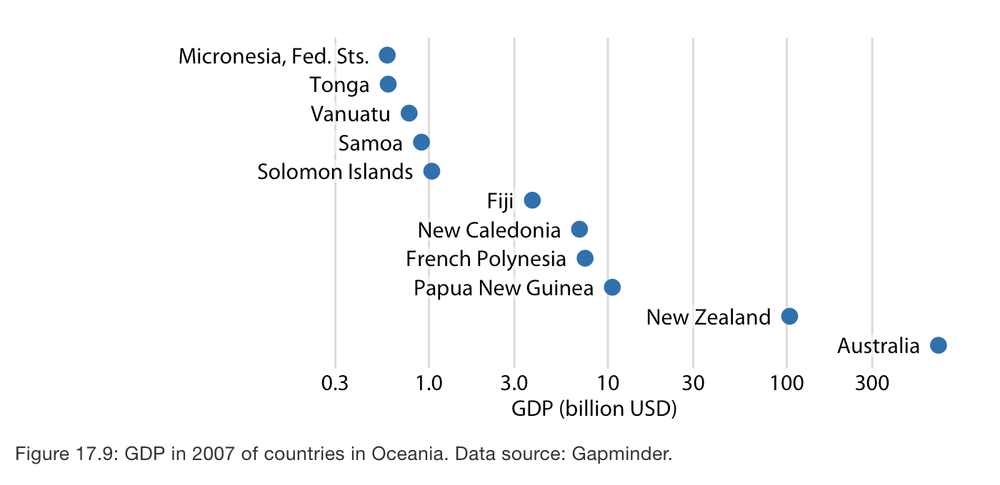

## How to properly work with log scales in bar plots {-}

- A log scale is the natural scale to visualize ratios, because a unit step along a log scale corresponds to multiplication with or division by a constant factor. 
- When bars are drawn on a log scale, they represent ratios and need to be drawn starting from 1, not 0.
- If we want to visualize ratios rather than amounts, however, bars on a log scale are a perfectly good option. In fact, they are preferable over bars on a linear scale in that case. 
- As an example, let’s visualize the GDP values of countries in Oceania relative to the GDP of Papua New Guinea. 

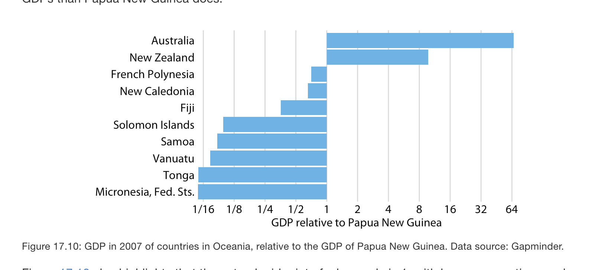

## Direct area visualization {-}

- Pie charts follow the principle of proportional ink because wedge area (via angle) is proportional to the data value.
- A pie wedge encodes a value as a combination of distances forming an area, which reduces accuracy.

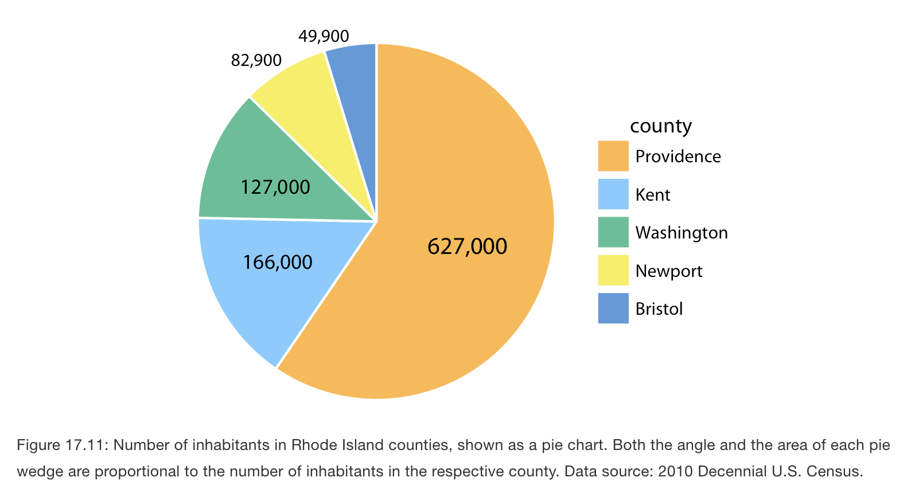

## Direct area visualiztion in bar graphs {-}

- However, people perceive pie chart areas differently than bar chart areas.
- Human perception is tuned to judge distances more accurately than areas.
- A bar encodes a value as a single distance (length), making it easier to read precisely.

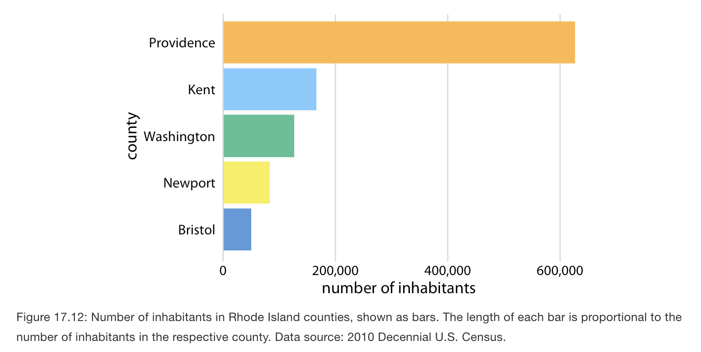

- The problem that human perception is better at judging distances than at judging areas also occurs in treemaps, which are square versions of pie charts. 

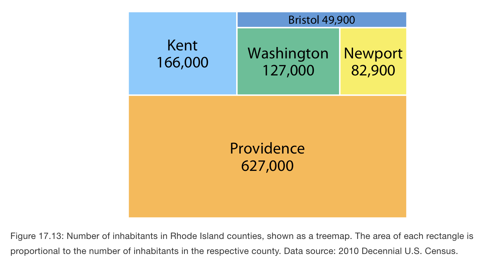
