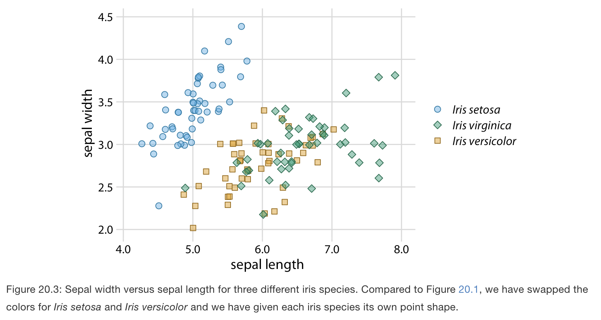

# Redundant coding

**Learning objectives:**

- Understand the concept of "redundant coding"

## Redundant coding {-}

- Redundant coding is a term coined by the author. 
- It refers to using multiple different aesthetic dimensions to convey information presented on a graph instead of relying only on color. 

# Designing legends with redundant coding for scatter plots {-}

- Scatter plots that represent different groups that differ by color. 
- The problem arises because the data points in two separate groups are not particularly distinct from each other.
- Using gray scale does not work because sometimes categories cannot be distinguishable enough. 

- To fix this problem: we can use three different symbol shapes, so that the points all look different.

# Designing legends with redundant coding for line graphs {-}

- In line plots, we could change the line type (solid, dashed, dotted, etc.) but often yields sub-optimal results especiallly for lines that are not straight. 
- Also in the following example, notice that the perceived order of the data lines differs from the order of the companies in the legend.  

-  To fix this problem: by manually reordering the entries in the legend so they match the preceived ordering in the data.

## Designing figures without legends {-}

- We can typically make our readers’ lives easier if we eliminate the legend altogether. 
- Eliminating the legend means that we design the figure in such a way that it is immediately obvious what the various graphical elements represent, even if no explicit legend is present.
- The general strategy we can employ is called direct labeling, whereby we place appropriate text labels or other visual elements that serve as guideposts to the rest of the figure.

## Other examples {-}

- This line plot is using two different shades of each color, a light one for filled areas and a dark one for lines, outlines, and text. 

- In the case where we map the same variable onto a position along a major axis and onto color, this implies that the reference color bar should run along and be integrated into the same axis. 

