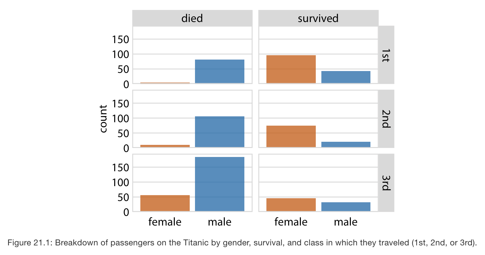
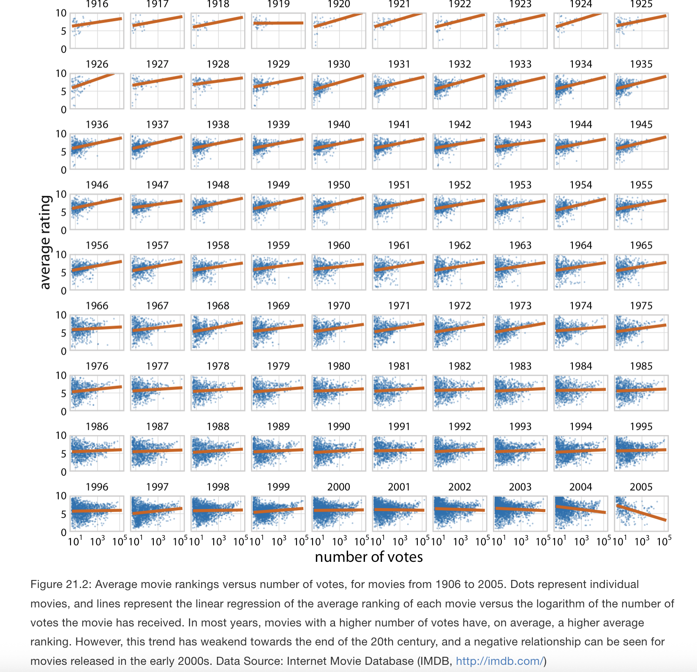
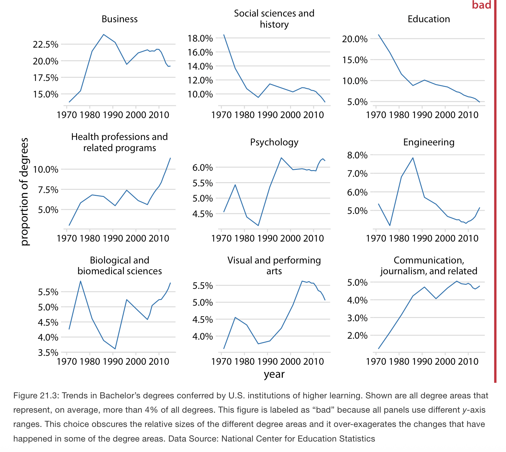
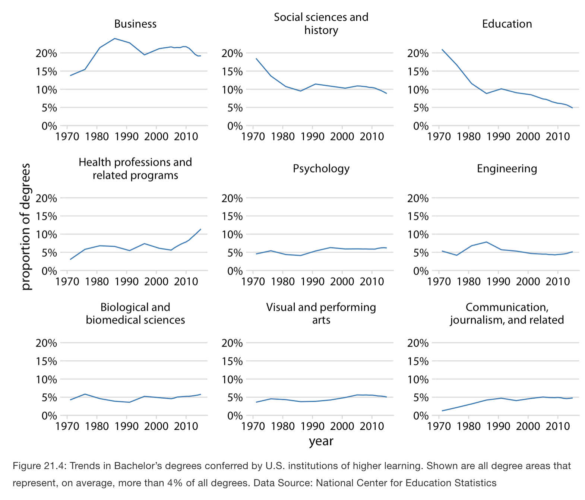
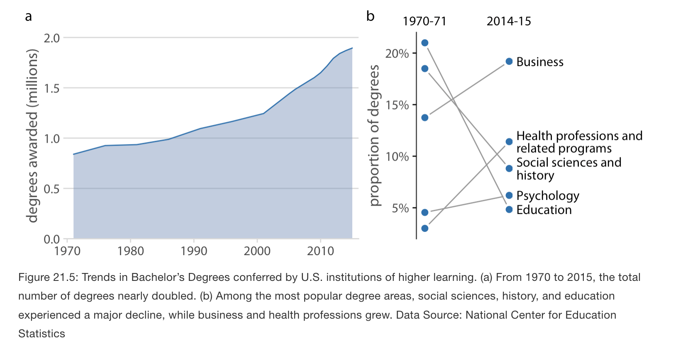
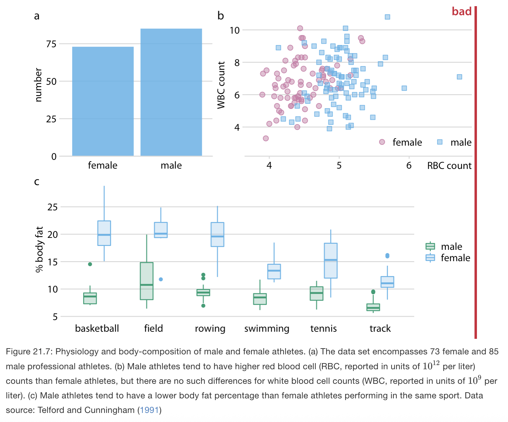
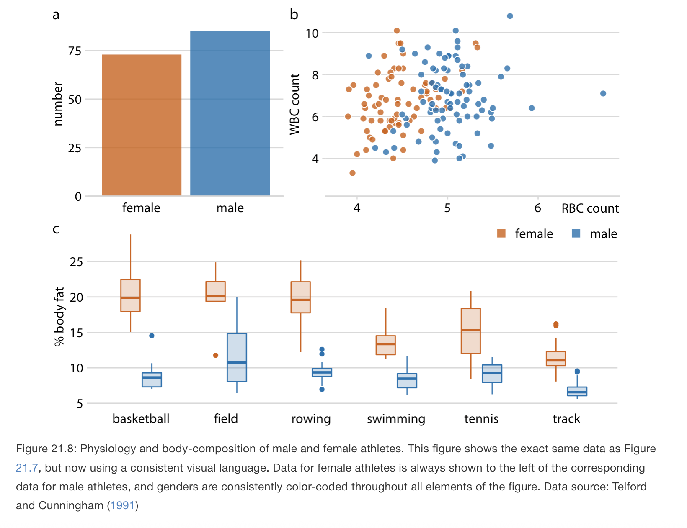

# Multi-panel figures

**Learning objectives:**

- Learn how to represent large and complex data using multi-panel figures. 
- Distinguish when to use each type of multi-panel figure. 

## Multi-panel figures {-}

- Working with large and complex datasets. 
- Multi-panel figures consist of multiple figure panels where each one shows some subset of the data.
- Two broad types of multi-panel figures:
  - Small multiples: same type of visualization repeated over slices of the data (grid layout) 
  - Compound figures: different panels showing different visualizations or even different datasets, arranged (not necessarily in a grid) into one composite figure 

- Key issues to watch out for when combining panels:
  - axis scaling and consistency across panels,
  - alignment of graphical elements,
  - maintaining a coherent “visual language” across panels.

## Small multiples {-}

- This idea refers to: slice dataset along one or more dimensions (e.g. by year, by class, by group), plot each slice using the same visualization style, then arrange panels in a grid.
- Also known as faceting (e.g., `facet_grid` in ggplot2)
- All panels should ideally use the same axis scales and ranges. If not, the reader may misinterpret differences (or be misled).
- If you must use different scales (rarely advisable), note it explicitly in the caption so the reader isn’t fooled.
- Panel ordering matters: the arrangement of panels should be meaningful or logical (e.g. chronological order, by magnitude, etc.).

## Compound figures {-}

- We can take the indivdiual plots and arrange them in rows, columns, or other, more complex arrangements, and call the entire arrangement one figure that conveys one overarching point. 
- Panels may show different kinds of plots or different datasets, but they are assembled into a composite figure. 
- Panels must be labeled (a, b, c, …) so one can refer to them precisely. This is needed because panels won’t have a natural grid-faceted labeling as in small multiples.  
  - It is conventional to use lower or upper case letters from the Latin alphabet.  

## Labeling compound figures {-}

- Labeling design matters: the labels should be unobtrusive (not overpowering), consistent in style (font, size) across figures, and integrated into the design.
- Panels must share a consistent visual language: same color schemes, symbol mappings, ordering of categories, etc. 
- Avoid conflicting encodings (e.g. one panel uses blue for “male,” another uses blue for “female”) 

## Consistency across panels {-}

- Maintain consistent ordering (e.g. for a categorical axis) across panels so that the viewer doesn’t have to relearn mapping. 
- Axes, gridlines, margins, panel sizes, etc. need to align well across panels. Misalignment makes the composite feel messy and can confuse comparisons.

